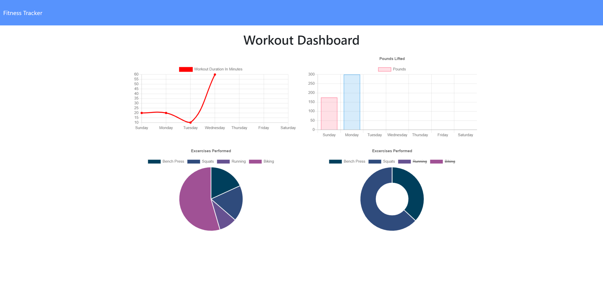

# Workout_Tracker
## Description

The Workout Tracker is an app that allows users to track their progress in the gym, or outdoors, to maximize their fitness results. The app is very convenient and easy to use as it will display the users most recent workout information as well as provide a stats page which logs all workouts for the last 7 days. This project uses Express.JS to help establish API and HTML routes for complete connectivity and utilizes a database through MongoDB. I was responsible for developing the MongoDB schema and then establishing the API and HTML Routes through mongoose. I was also responsible for deploying the website and MongoDB database through Heroku.

## Table of Contents

* [License](#license)
* [Contributing](#contributing)
* [Screenshot](#screenshot)
* [Link](#link)
* [Questions](#questions)

## License

MIT

## Contributing

Ianaac27

Trilogy Education Services

# Screenshot
Here is a mock of the Workout Tracker.

# Link
Take a look at the live version through Heroku [here.](https://workout-tracker-ifc.herokuapp.com/)
